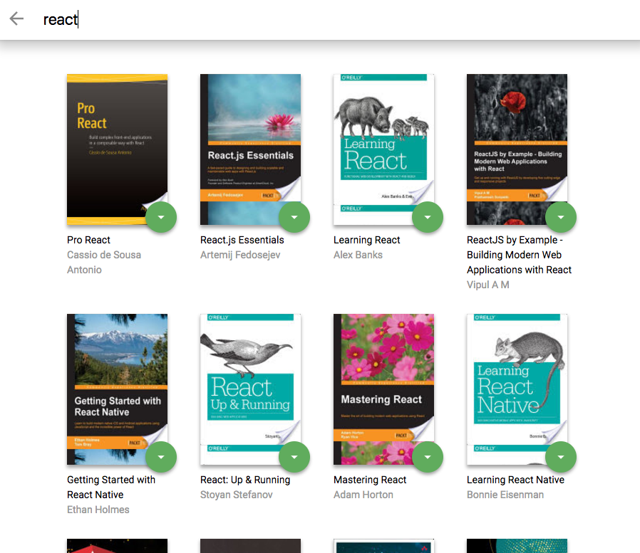
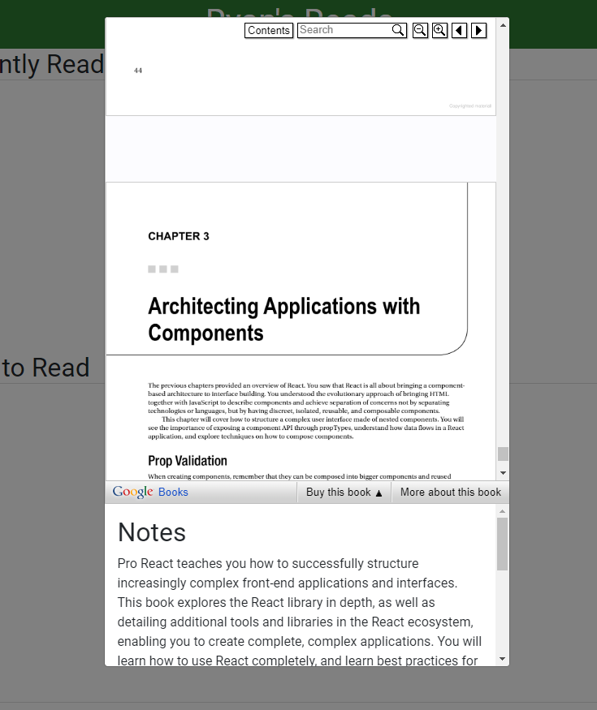

# Ryan's Reads
(with hook)

A responsive web app which keeps track of the books you are **currently viewing**, **want to read** and those you have already **read**. 

You can **transfer** books among the three bookshelves by the shelf changer attached to each book.

It also provides **search** functionlity, allows you to look for books by name or author so that you can eventually add them to one of your three shelves. 



Wait, there is more! You can actually read with it 🤓



## Installation

```sh
yarn && yarn start
```
